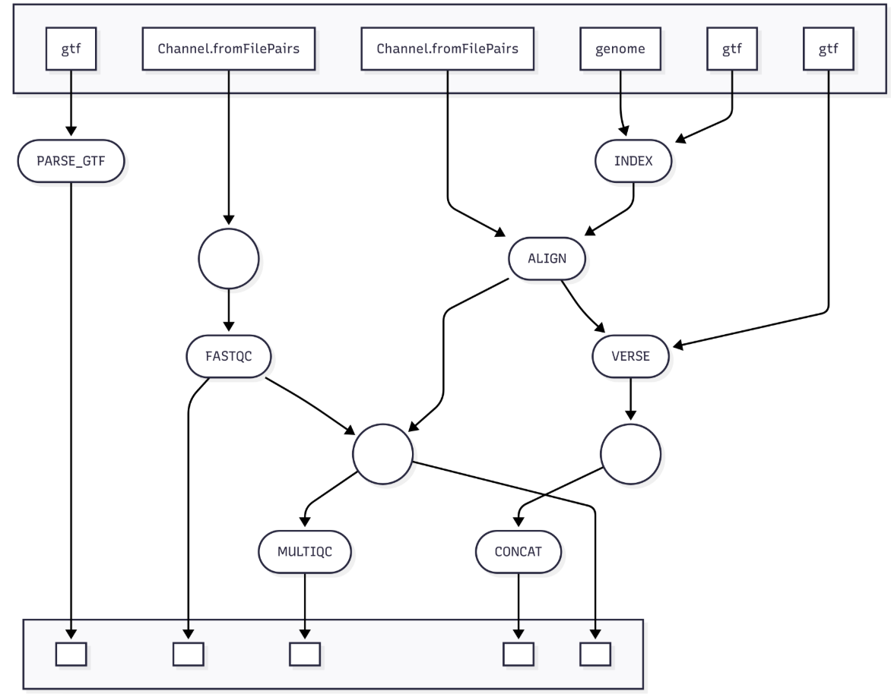

# Bulk RNA-seq Analysis Pipeline

This pipeline performs processing of bulk RNA-seq data to quantify gene expression, including alignment, quality control, read filtering, count summarization, and normalization. It is organized with modular Nextflow processes and supports execution both on the BU Shared Computing Cluster (SCC) and AWS.

## Table of Contents
1. Features
2. Workflow Visualization
3. Requirements
4. Installation
5. Usage
6. Configuration
7. Input and Output
8. Contributing

## Features
- Modular Nextflow pipeline with clear separation of steps:
  - Read quality control (FASTQC)
  - Reference genome parsing (PARSE_GTF)
  - STAR genome indexing (STAR_INDEX)
  - Alignment with STAR (STAR_ALIGN)
  - MultiQC report aggregation (MULTIQC)
  - Gene expression quantification (VERSE)
  - Concatenation of counts across samples (CONCAT_COUNTS)
- Docker/Singularity container support for reproducibility
- Automatic logging and error handling
- Scalable to large RNA-seq datasets
- Supports both BU SCC and AWS Batch execution

## Workflow Visualization


## Requirements
- Must have a conda environment with nextflow in order to run nextflow
- Modules already installed on BU Shared Computing cluster (SCC)
- If using aws, see envs file for all packages to install
- If not using BU SCC, see envs directory for software and version information
 
## Installation
  - Clone this repository in the SCC
  - git clone ['https://github.com/JackSherry6/Waxman-Lab-snRNA-seq-SNP-Calling-Pipeline.git'](https://github.com/JackSherry6/bulk-RNAseq-standard-analysis-pipeline.git)
 
## Usage
Basic execution: 
- ```module load miniconda```
- ```conda activate <name_of_your_nexflow_conda_env>```
- Set params.samples to the location of the folder containing your files
- Set params.ref_genome, ref_index, ref_dict to their respective file locations
- Modify the samples.csv file according to your sample names and groups 
- ```nextflow run main.nf -profile conda,cluster``` (for waxman lab you should always run on the cluster, but if using aws, substitute ```aws``` for ```cluster```)

## Configuration
- Edit the nextflow.config file to:
  - Set input paths (reads, genome, gtf)
  - Adjust queueSize based on the number of samples
  - Optionally set resume = true to continue interrupted runs

## Input and Output
- Input:
  - Folder of FASTQ files (paired-end _R1 and _R2)
  - Reference genome FASTA, index, and GTF files
- Output:
  - Results folder with QC reports, aligned BAM files, and gene count matrices

## Contributing 
- Email me at jgsherry@bu.edu for additional information or contributing information
